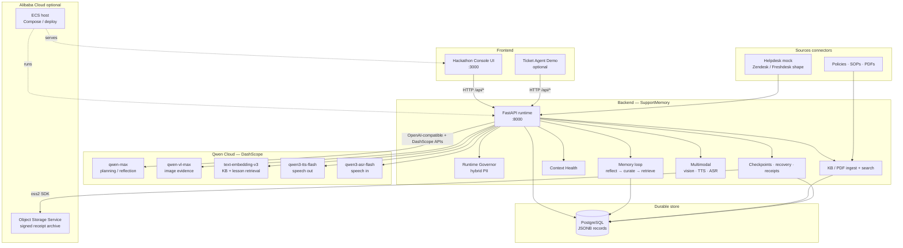

# SupportMemory — a customer support agent that never forgets

**Track 1: MemoryAgent · Qwen Cloud**

Support agents that use LLMs today mostly start cold every session. They re-ask questions the customer already answered, re-investigate issues that were already diagnosed, and lose everything if the process crashes mid-task. That is a **memory** problem — not a model problem.

**SupportMemory** is a customer support agent on **Qwen Cloud** that:

- **Recalls** prior ticket findings, curated lessons, and KB/policy context across sessions
- **Recovers** from a crash without repeating work (trusted checkpoints in PostgreSQL)
- **Gets better the second time** it sees a related task (reflect → curate → retrieve)
- **Proves** what it remembered with a SHA-256 hashed, Ed25519-signed execution receipt (optional Alibaba OSS archive)

Under the hood: task contracts, context health, tool traces, hybrid Runtime Governor, checkpoints, recovery, multimodal memory, and signed receipts.

```text
SupportMemory  →  remember · forget · recall · recover · prove
```

---

## Track 1: MemoryAgent fit

| Track ask | How SupportMemory delivers it |
|---|---|
| Efficient storage & retrieval | Curated playbook rules + KB chunks with Qwen embeddings (`text-embedding-v3`) |
| Timely forgetting | Context Health staleness / compress / redact / exclude |
| Recall in limited context | Top‑K lessons + KB injected as `context_prefix` before planning |
| Cross-session improvement | Reflect → curate → retrieve on the next related run |
| Multimodal / production on Qwen | Chat (`qwen-max`), vision (`qwen-vl-max`), TTS, ASR, embeddings |

---

## Quick start

```bash
cp .env.example .env
# Recommended for the live demo:
#   QWEN_API_KEY=sk-...
#   DEFAULT_MODEL_GATEWAY=qwen
#   EMBEDDING_PROVIDER=auto
#   RUNTIME_GOVERNOR_PII_MODE=hybrid

docker compose up --build
```

| Surface | URL |
|---|---|
| UI | http://localhost:3000 |
| API docs | http://localhost:8000/docs |
| Health | http://localhost:8000/health |

Click **Run Agent Recovery Demo** (or call `POST /api/demo/failure-recovery`).

### Offline / no Docker

```bash
# Service-level SupportMemory E2E (governor, KB/PDF, language, Qwen, memory loop)
python scripts/e2e_supportmemory.py

# PDF ingest smoke test
python scripts/test_pdf_kb_ingest.py

# API unit tests
cd services/api && python -m pytest tests -q
```

### Keyless vs live Qwen

| Mode | Config | Behavior |
|---|---|---|
| Keyless | `DEFAULT_MODEL_GATEWAY=mock` (or no `QWEN_API_KEY`) | Deterministic plans/tools; hash embeddings; vision fallback |
| Live Qwen | `QWEN_API_KEY` set, `DEFAULT_MODEL_GATEWAY=qwen` | `qwen-max`, `qwen-vl-max`, `qwen3-tts-flash`, `qwen3-asr-flash`, `text-embedding-v3` |

Helpdesk connectors stay **Zendesk/Freshdesk-shaped mocks** so judges can run without CRM keys. Swap the same contract for live APIs later.

---

## What the demo proves

1. Task contract is saved  
2. Context Health filters stale/noisy context  
3. Tools are traced under the Runtime Governor  
4. Checkpoint saved to PostgreSQL  
5. Failure is simulated → recovery restores trusted state  
6. Lessons are reflected, curated, and retrieved on a related run  
7. KB / PDF / multimodal evidence can feed the next plan  
8. Signed execution receipt proves what was recalled and done  

Without SupportMemory: fail → restart → repeat tools → incomplete answer  
With SupportMemory: checkpoint restored → continue → receipt generated  

---

## Architecture

Clear system view of how the frontend, SupportMemory backend, PostgreSQL, and **Qwen Cloud** connect:



### Request path (happy path)

1. **Frontend** (`:3000`) starts a run or demo against the **FastAPI** backend (`:8000`).  
2. Backend loads prior **KB + playbook memory** from **PostgreSQL**, applies **Context Health**, and calls **Qwen Cloud** for planning / vision / voice / embeddings.  
3. Tools run under the **Runtime Governor**; progress is **checkpointed** in Postgres.  
4. On failure, recovery restores the last trusted checkpoint; on success/failure, **reflect → curate** may write a new lesson.  
5. A signed **execution receipt** is returned to the UI and optionally archived to **Alibaba OSS**.

Deploy assets: `infra/alibaba/` (ECS + OSS). Legacy Vultr assets remain under `infra/vultr/` but are not the primary path.

---

## Core capabilities

### Memory lifecycle
- **Reflect** on a real execution trace → candidate lesson  
- **Curate** (safety / PII / dedupe / HMAC) → approved playbook rule  
- **Retrieve** top‑K rules + KB chunks into context before planning  

### Knowledge & connectors
- **Real text/PDF ingest** → chunk → embed → Postgres → search  
- **Helpdesk mock** (`zendesk_mock` / `freshdesk_mock`) with ticket-shaped payloads  
- Improved hybrid search: Qwen embeddings when keyed + coverage/phrase ranking  

### Runtime Governor (PII)
Default **hybrid**:

| Tool kind | PII found | Action |
|---|---|---|
| Reads / internal | yes | **Redact** → allow |
| External (`send_*`, `refund_*`, …) | yes | **`require_approval`** (or `block`) |

```env
RUNTIME_GOVERNOR_PII_MODE=hybrid
RUNTIME_GOVERNOR_EXTERNAL_PII_MODE=require_approval
```

Inspect: `GET /api/governor/policy`

### Multimodal (Qwen Cloud only)
- **Images** → `POST /api/multimodal/analyze` (`qwen-vl-max`, deterministic fallback without key)  
- **TTS** → `POST /api/voice/run-summary` (`qwen3-tts-flash`)  
- **ASR** → `POST /api/voice/transcribe` (`qwen3-asr-flash`)  
- **Language preference** self-adjusts from stored preference or detected language  

```env
QWEN_TTS_MODEL=qwen3-tts-flash
QWEN_ASR_MODEL=qwen3-asr-flash
QWEN_VL_MODEL=qwen-vl-max
EMBEDDING_PROVIDER=auto
QWEN_EMBEDDING_MODEL=text-embedding-v3
```

---

## Main API endpoints

| Method | Endpoint | Purpose |
|---|---|---|
| POST | `/api/demo/failure-recovery` | One-click judge recovery demo |
| POST | `/api/tasks/run` | Start a durable task run |
| POST | `/api/tasks/recover` | Restore from a trusted checkpoint |
| POST | `/api/traces/{trace_id}/reflect` | Derive a lesson from a trace |
| POST | `/api/reflections/{id}/curate` | Promote a safe lesson into the playbook |
| POST | `/api/lessons/retrieve` | Retrieve lessons (+ KB) for a task |
| GET | `/api/traces/{trace_id}/receipt` | Signed execution receipt |
| POST | `/api/kb/ingest` | Ingest policy/SOP text |
| POST | `/api/kb/ingest/pdf` | Ingest a PDF |
| POST | `/api/kb/search` | Search KB chunks |
| POST | `/api/kb/seed-demo` | Seed sample support KB docs |
| POST | `/api/connectors/helpdesk/mock` | Zendesk/Freshdesk-shaped mock source |
| POST | `/api/multimodal/analyze` | Analyze image evidence |
| POST | `/api/voice/run-summary` | Qwen-TTS spoken summary |
| POST | `/api/voice/transcribe` | Qwen-ASR transcription |
| PUT | `/api/preferences/language` | Set user preferred language |
| GET | `/api/preferences/language/{user_id}` | Read language preference |
| GET | `/api/governor/policy` | Inspect Runtime Governor policy |
| POST | `/api/context-health/build` | Build clean context + receipt |

Full interactive docs: http://localhost:8000/docs

---

## Repository map

```text
supportmemory/
├── apps/console/                 # Main UI (:3000) → hackathon-ui.html
├── apps/ticket-agent-demo/       # Reference support chat UI
├── services/api/                 # FastAPI runtime
├── services/mock-tools/          # Keyless MCP-style ticket/policy tools
├── workers/recovery-worker/      # Recovery worker
├── packages/sdk-python/          # Python SDK + framework adapters
├── packages/sdk-typescript/      # TypeScript SDK
├── examples/                     # Reference agents / scenarios
├── infra/alibaba/                # Primary cloud deploy (ECS + OSS)
├── docs/                         # Architecture, judging, API notes
├── scripts/e2e_supportmemory.py  # Offline SupportMemory E2E
├── HACKATHON_UI.html             # UI source of truth
├── docker-compose.yml
├── .env.example
└── LICENSE
```

UI design contract: `UI_SOURCE_OF_TRUTH.md`.

---

## Why this is not just a dashboard

Observability tools show what happened after failure. SupportMemory makes the run **recoverable and improvable**:

```text
Task contract → Context Health → Tool traces → Checkpoint
     → Failure → Restore → Reflect/Curate → Retrieve → Receipt
```

---

## License

Apache-2.0
